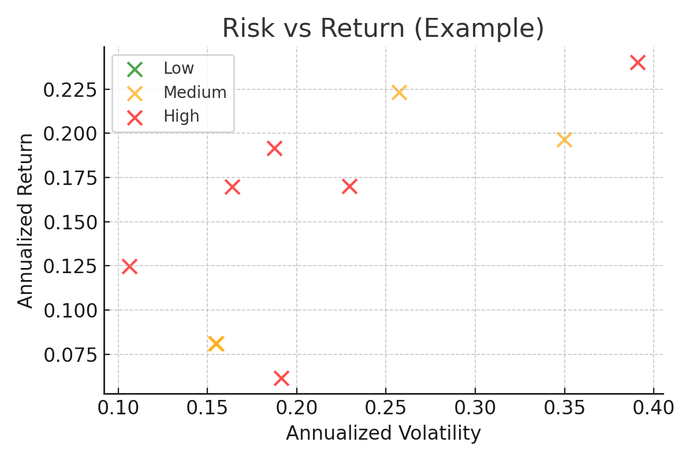
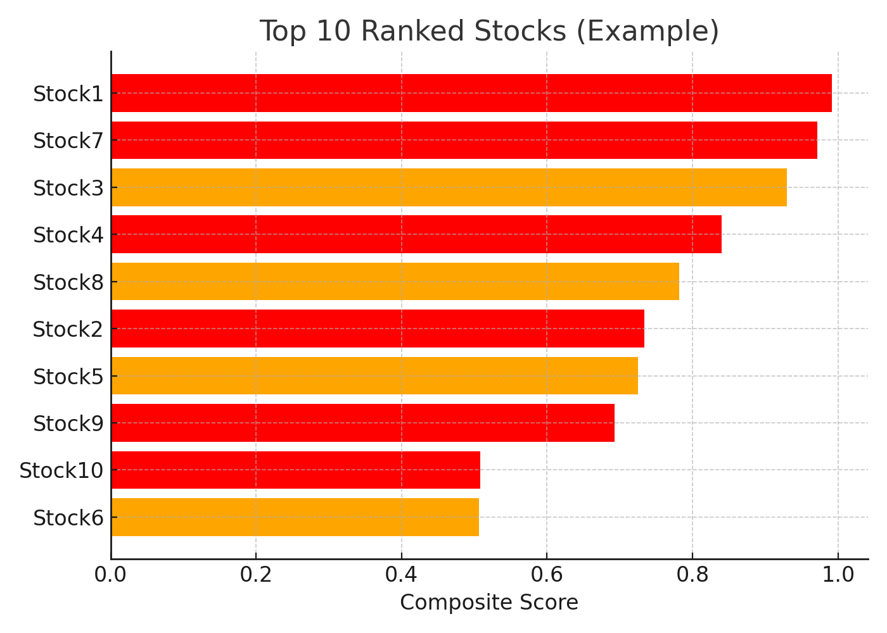

# 📈 Investment Recommendation System (Stocks / ETFs / Mutual Funds)

This project is a **Streamlit-based web app** that helps users:
- Enter stock, ETF, or mutual fund tickers (e.g., AAPL, MSFT, SPY)
- Analyze their performance
- Get recommendations
- Rank them from best → worst
- Optimize a portfolio

---

## 🌟 Features
✔️ Fetches stock data from **Yahoo Finance (yfinance)**  
✔️ Computes **financial metrics** (Return, Volatility, Sharpe Ratio, Drawdown, Mean Daily Return)  
✔️ Provides **risk-based clustering** (Low, Medium, High)  
✔️ Generates **recommendations** (content-based + collaborative boost)  
✔️ Allows users to **tune weights** for custom ranking  
✔️ Visualizes results with **scatter plots** and **bar charts**  

---

## 🏗 How It Works (Baby Steps)
1. **You tell the app which tickers you want** (e.g., AAPL, TSLA, SPY).  
2. **The app fetches stock prices** from Yahoo Finance.  
3. **It calculates metrics**:
   - 📈 Annual Return → How much it grows in a year  
   - ⚡ Volatility → How much the price jumps up and down  
   - 💡 Sharpe Ratio → Profit compared to risk  
   - 📉 Max Drawdown → Worst dip from a peak  
   - 🔄 Mean Daily Return → Average daily growth  
4. **The app ranks them** (best → worst).  
5. **You can tune sliders** to say:  
   - "I like safer stocks" → More weight on Volatility  
   - "I want fast growth" → More weight on Annual Return  
6. **Finally, it shows charts** 🎨 so you can *see* which stocks are better.

---

## 🚀 Run Locally
```bash
git clone https://github.com/your-username/investment-recommendation-system.git
cd investment-recommendation-system
pip install -r requirements.txt
streamlit run src/recommendation_app.py
```

---

## 📊 Example Visuals
### Risk vs Return Scatter


### Ranking Bar Chart


---

## ⚠️ Disclaimer
This project is **educational only**. It is **NOT financial advice**. Always do your own research before investing.
